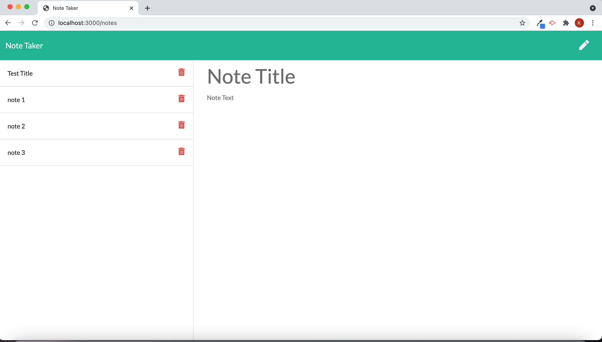

# Note Taking application Using Express JS
    
## Table of Contents
* [Description](#description) 
* [Installation](#installation)
* [Usage](#usage)
* [Credits](#credits)
* [License](#license)
* [Badge](#badge)
* [Questions](#questions)
    
## Description
* note taking application that uses express JS for adding, storing and deleting notes for personal use.
    
## Installation
* no installation necessary.  Application is run online from heroku.com
    
## Usage
* program is run from Heroku.com and is launched from the root directory by using the command node server.js.

    
## Credits
* N/A
    
## License
* Licensed by mit
    
## Badge

    
## Questions
* For any questions, concerns, or additional help, please contact klucas72@hotmail.com.
